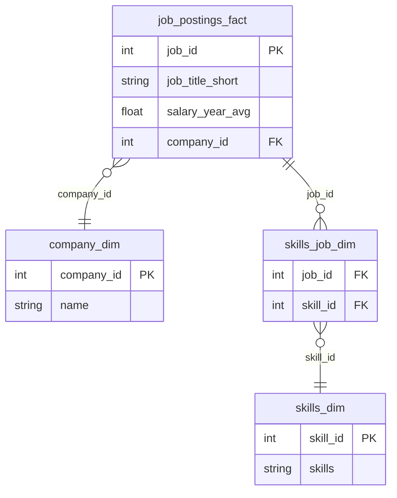
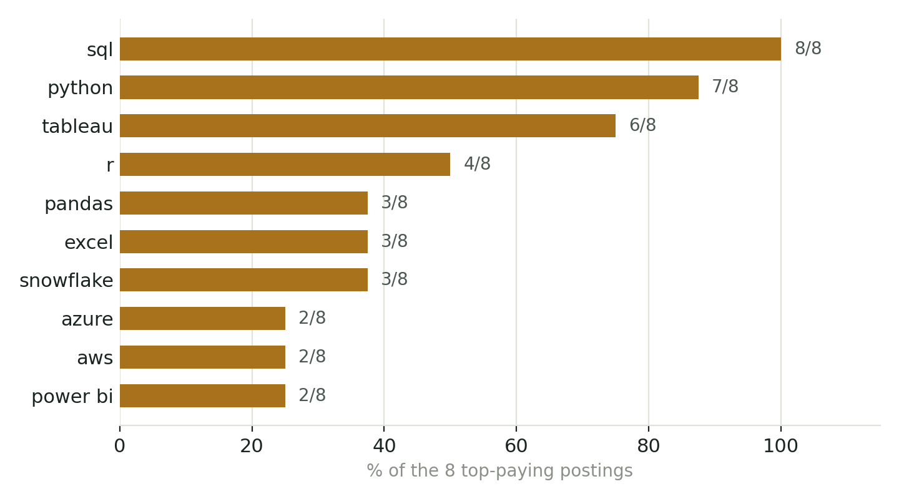
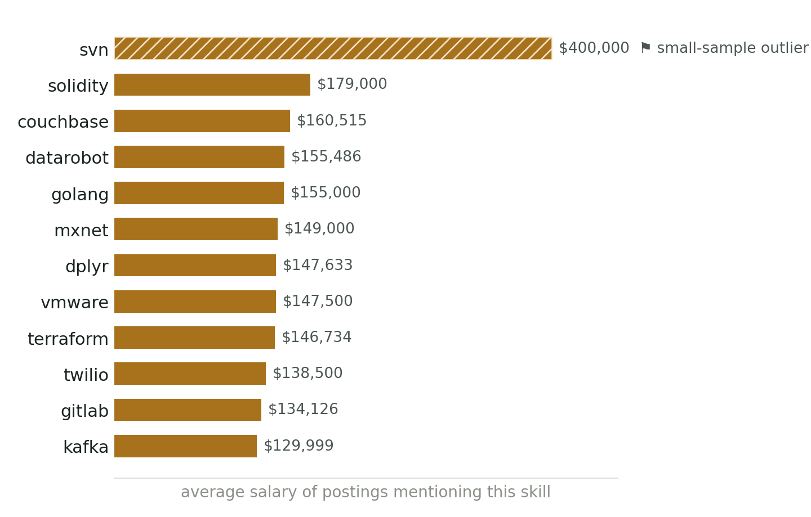
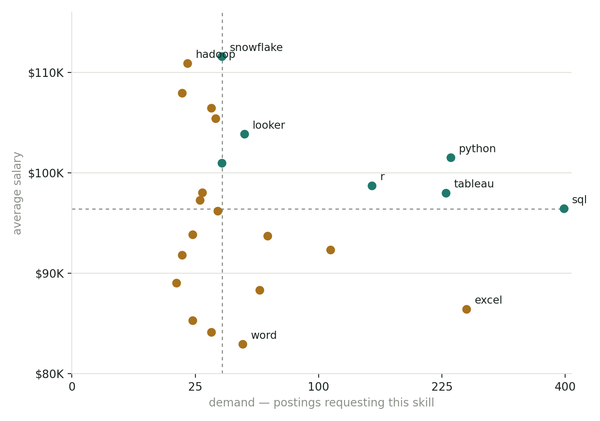

# Querying My Way Into the Data Analyst Job Market

A SQL project built entirely in T-SQL / SQL Server Management Studio — five queries against a real job-postings dataset, each one answering a question I actually wanted answered before job hunting as a data analyst: which jobs pay the most, what they ask for, which skills pay the most overall, and which skills are actually worth learning first.


## Contents

- [Introduction](#introduction)
- [Background](#background)
- [Tools I Used](#tools-i-used)
- [The Analysis](#the-analysis)
  - [Query 1 — Top Paying Jobs](#query-1--top-paying-data-analyst-jobs)
  - [Query 2 — Skills for Those Jobs](#query-2--skills-required-by-those-top-paying-jobs)
  - [Query 3 — Top Paying Skills](#query-3--top-paying-skills-across-all-data-analyst-postings)
  - [Query 4 — Optimal Skills](#query-4--optimal-skills--demand-and-salary-together)
- [What I Learned](#what-i-learned)
- [Conclusions](#conclusions)

## Introduction

This project started as a straightforward question: **if I were job-hunting as a data analyst right now, what should I actually learn — and what should I expect to get paid for it?** Rather than trust a listicle, I decided to answer it myself, directly from job-posting data, in SQL.

The result is four connected queries that build on each other: first finding the highest-paying Data Analyst roles, then the skills those specific roles ask for, then zooming out to see which skills pay the most across the whole dataset, and finally combining pay with demand to find the skills that are worth learning first — not just the ones that pay the most in theory.

Every query below ran against a live SQL Server database, and every chart is built from its actual result set — nothing here is illustrative.

## Background

The data models a year of job postings across four related tables: one fact table of postings, and three dimension tables describing the company, the required skills, and how skills map onto each posting. Every query in this project is some variation of joining across this same shape.



## Tools I Used

| Tool | What it was for |
|---|---|
| **SQL Server & SSMS** | All querying, table design, and data loading |
| **T-SQL** | CTEs, joins across four tables, and `HAVING`-filtered aggregates |
| **BULK INSERT / CSV** | Loading the source data from flat files |
| **Git & GitHub** | Versioning the queries and this write-up together |
| **Python (matplotlib)** | The charts embedded below, generated from each query's actual output |

## The Analysis

### Query 1 — Top paying Data Analyst jobs

Starting point: which remote Data Analyst postings paid the most, and at which companies?

<details>
<summary>View query</summary>

```sql
SELECT TOP 10
    j.job_id,
    j.job_title,
    j.salary_year_avg,
    c.name AS company_name
FROM job_postings_fact j
LEFT JOIN company_dim c ON j.company_id = c.company_id
WHERE j.job_title_short = 'Data Analyst'
    AND j.job_location = 'Anywhere'
    AND j.salary_year_avg IS NOT NULL
ORDER BY j.salary_year_avg DESC;
```

</details>

| Title | Company | Salary |
|---|---|---:|
| Associate Director, Data Insights | AT&T | $255,830 |
| Data Analyst, Marketing | Pinterest | $232,423 |
| Data Analyst (Hybrid/Remote) | UCLA Health | $217,000 |
| Principal Data Analyst (Remote) | SmartAsset | $205,000 |
| Director, Data Analyst | Inclusively | $189,309 |
| Principal Data Analyst, AV Perf. | Motional | $189,000 |
| Principal Data Analyst | SmartAsset | $186,000 |
| ERM Data Analyst | Get It Recruit | $184,000 |

8 of the top 10 had a usable skills list — those 8 carry through to Query 2.

### Query 2 — Skills required by those top-paying jobs

Same 8 jobs — this time unpacking which specific skills each one listed, to see what the highest earners actually have in common.

<details>
<summary>View query</summary>

```sql
SELECT
    j.job_id, j.job_title, j.salary_year_avg,
    c.name AS company_name, sd.skills
FROM job_postings_fact j
INNER JOIN skills_job_dim s ON j.job_id = s.job_id
INNER JOIN skills_dim sd ON sd.skill_id = s.skill_id
LEFT JOIN company_dim c ON j.company_id = c.company_id
WHERE j.job_id IN (/* the 8 job_ids from Query 1 */)
ORDER BY j.salary_year_avg DESC;
```

</details>

<picture>
  <source media="(prefers-color-scheme: dark)" srcset="assets/q2_skill_frequency_dark.png">
  
</picture>

SQL and Python are the only two skills every top earner had in common — everything past that (Tableau, R, cloud tooling) is more situational, and 15 more skills each showed up on exactly one posting.

### Query 3 — Top paying skills, across all Data Analyst postings

Zooming out from 8 jobs to the whole dataset: which individual skills are associated with the highest average salary?

<details>
<summary>View query</summary>

```sql
SELECT
    sd.skills,
    ROUND(AVG(CAST(j.salary_year_avg AS FLOAT)), 0) AS avg_salary
FROM job_postings_fact j
INNER JOIN skills_job_dim s ON j.job_id = s.job_id
INNER JOIN skills_dim sd ON sd.skill_id = s.skill_id
WHERE j.job_title_short = 'Data Analyst'
    AND j.salary_year_avg IS NOT NULL
GROUP BY sd.skills
ORDER BY avg_salary DESC;
```

</details>

<picture>
  <source media="(prefers-color-scheme: dark)" srcset="assets/q3_top_paying_skills_dark.png">
  
</picture>

> **SVN's $400K is almost certainly noise, not signal.** This query has no posting-count column — SVN's average is more than 3× the next-highest skill, the classic signature of an average built from one or two postings. Confirmed with a follow-up query adding `COUNT(job_id)`, which is exactly what Query 4 does.

### Query 4 — Optimal skills, demand *and* salary together

The fix for Query 3's blind spot: pairing average salary with how many postings actually ask for each skill, so a real signal can be told apart from a lucky outlier.

<details>
<summary>View query</summary>

```sql
WITH skills_demand AS (
    SELECT s.skill_id, sd.skills,
        COUNT(s.job_id) AS demand_count
    FROM job_postings_fact j
    INNER JOIN skills_job_dim s ON j.job_id = s.job_id
    INNER JOIN skills_dim sd ON sd.skill_id = s.skill_id
    WHERE j.job_title_short = 'Data Analyst'
        AND j.job_work_from_home = 'TRUE'
        AND j.salary_year_avg IS NOT NULL
    GROUP BY s.skill_id, sd.skills
),
average_salary AS (
    SELECT s.skill_id,
        ROUND(AVG(CAST(j.salary_year_avg AS FLOAT)), 0) AS avg_salary
    FROM job_postings_fact j
    INNER JOIN skills_job_dim s ON j.job_id = s.job_id
    WHERE j.job_title_short = 'Data Analyst'
        AND j.salary_year_avg IS NOT NULL
    GROUP BY s.skill_id
)
SELECT d.skills, d.demand_count, a.avg_salary
FROM skills_demand d
INNER JOIN average_salary a ON d.skill_id = a.skill_id
ORDER BY d.demand_count DESC;
```

</details>

<picture>
  <source media="(prefers-color-scheme: dark)" srcset="assets/q4_demand_vs_salary_dark.png">
  
</picture>

SQL, Python, Tableau, and R (teal) cleared both medians — the actual answer to the question this whole project started with. Snowflake, Looker, and Hadoop sit at moderate demand but punch well above median pay, a real signal since it's backed by dozens of postings rather than one or two.

## What I Learned

Getting to those four result sets meant working through a string of real problems along the way. Logging them here because each one changed how I write queries now.

| # | Category | What happened | Fix |
|---|---|---|---|
| 1 | Aggregation | `MAX()` on a value already formatted as a string (`CONCAT(..., '%')`) sorts alphabetically, not numerically — `'9.8%'` outranks `'17.2%'` as text | Aggregate the raw number first, format last |
| 2 | Data types | `ROUND()` on a `FLOAT` looks right on screen, then reveals its binary imprecision once `CONCAT`'d into text | Cast the rounded value to `DECIMAL` before concatenating |
| 3 | CTEs | Writing `) d` right after a CTE body is invalid syntax — this was the actual bug behind Query 4 | Alias belongs in the outer query's `FROM`/`JOIN`, exactly like a table alias |
| 4 | Referential integrity | `TRUNCATE` refuses to run if *any* FK references the table, even with zero matching child rows | Clear or reorder around the child table first, or use `DELETE` instead |
| 5 | ETL | The Import Flat File wizard rebuilds its table from scratch on every run — manually widening a column afterward did nothing | Pre-create the table and load with `BULK INSERT` instead |
| 6 | Results hygiene | `sas` appeared twice under two different `skill_id`s with identical demand and salary — a dirty dimension row | Would double-count in any downstream `SUM()` if left unchecked |
| 7 | Statistics | An average with no sample size attached can't be trusted — Query 3's $400K SVN result looked like a finding until Query 4 added a demand count | Never ship a `GROUP BY … AVG()` without a `COUNT()` next to it |

## Conclusions

**SQL and Python first** — they're the only two skills every top-paying posting in this dataset had in common, and the only pair that clears both the demand and salary median across the whole market. **Tableau and R** round out the core four.

Past that baseline, **Snowflake, Looker, and Oracle** stood out as genuine differentiators — moderate demand, consistently high pay, backed by enough postings to trust the number. And the project's other conclusion mattered just as much as the skills one: **never trust a ranking without checking what it's built on.** The most expensive-looking "insight" in this whole dataset turned out to be one job posting wearing an average's clothing.

| Priority | Skills | Why |
|---|---|---|
| Learn first | SQL, Python, Tableau, R | High demand *and* above-median pay, together |
| Learn to differentiate | Snowflake, Looker, Oracle | Fewer postings ask, but the ones that do pay well |
| Always double-check | — | Pair every `AVG()` with a `COUNT()` before trusting what it's telling you |

---

<sub>Based on a 2023 snapshot of Data Analyst job postings. Queries and analysis by me; charts generated from each query's actual result set.</sub>
